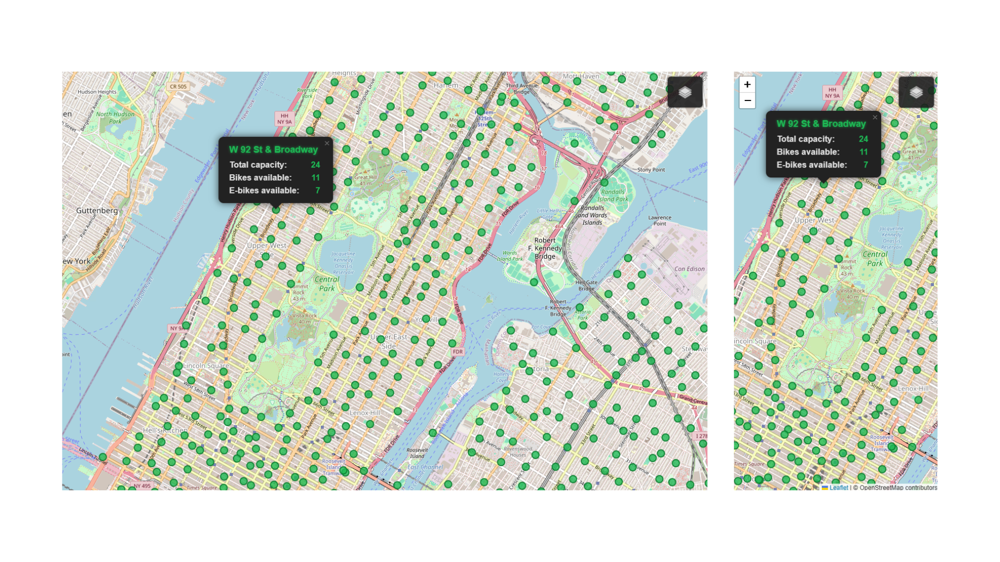

## 🚲 NYC Citi Bike Stations Map

This project is a sleek and modern web app that shows real-time information about Citi Bike stations in New York City using Leaflet and the official Lyft GBFS APIs.

## 🚀 Features

-Two base map styles: OpenStreetMap (default) and Esri Satellite
-Stations displayed as interactive circle markers
-Click on a station to see details: name, total capacity, available bikes, and available e-bikes
-Station status data is cached for 1 minute to optimize API calls
-Clean, dark-themed, and elegant UI with smooth popups and loading indicator

## 🖼️ Demo

## ⚙️ Technologies

-HTML/CSS/JavaScript
-Leaflet.js for maps
-Lyft GBFS APIs for station information and status:
-Station information: https://gbfs.lyft.com/gbfs/1.1/bkn/es/station_information.json
-Station status: https://gbfs.lyft.com/gbfs/1.1/bkn/es/station_status.json
## 📦 Setup

1. Clone this repository
2. Open index.html directly in your browser (no build step needed)
3. Enjoy exploring Citi Bike stations and their live availability in NYC!

## 📝 License
MIT